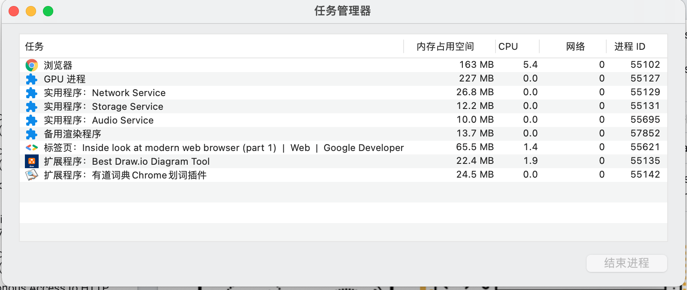

# 浏览器工作原理
- [浏览器工作原理](#浏览器工作原理)
  - [1. 浏览器的多进程架构](#1-浏览器的多进程架构)
  - [2. JS执行机制](#2-js执行机制)
    - [2.1. 调用栈](#21-调用栈)
    - [2.2. 词法作用域](#22-词法作用域)
    - [2.3. 闭包](#23-闭包)
    - [2.4. this](#24-this)
  - [3. V8原理](#3-v8原理)
  - [2. 页面渲染原理](#2-页面渲染原理)
  - [3. 网络](#3-网络)
    - [3.1. 浏览器端发起 HTTP 请求流程](#31-浏览器端发起-http-请求流程)
    - [3.2. TCP的三次握手和四次挥手](#32-tcp的三次握手和四次挥手)
    - [3.3. https](#33-https)
    - [3.4. http2](#34-http2)
    - [3.5. http3](#35-http3)
  - [4. 浏览器安全](#4-浏览器安全)
  - [5. 参考资料](#5-参考资料)

## 1. 浏览器的多进程架构

  

从图中可以看出， Chrome 浏览器包括：1 个浏览器（Browser）主进程、1 个 GPU 进程、1 个网络（NetWork）进程、多个渲染进程和多个插件进程。

1. 浏览器进程。主要负责界面显示、用户交互、子进程管理，同时提供存储等功能。
2. 渲染进程。核心任务是将 HTML、CSS 和 JavaScript 转换为用户可以与之交互的网页，排版引擎 Blink 和 JavaScript 引擎 V8 都是运行在该进程中，默认情况下，Chrome 会为每个 Tab 标签创建一个渲染进程。出于安全考虑，渲染进程都是运行在沙箱模式下。
3. GPU 进程。其实，Chrome 刚开始发布的时候是没有 GPU 进程的。而 GPU 的使用初衷是为了实现 3D CSS 的效果，只是随后网页、Chrome 的 UI 界面都选择采用 GPU 来绘制，这使得 GPU 成为浏览器普遍的需求。最后，Chrome 在其多进程架构上也引入了 GPU 进程。
4. 网络进程。主要负责页面的网络资源加载，之前是作为一个模块运行在浏览器进程里面的，直至最近才独立出来，成为一个单独的进程。插件进程。主要是负责插件的运行，因插件易崩溃，所以需要通过插件进程来隔离，以保证插件进程崩溃不会对浏览器和页面造成影响。  

下图是一个打开了 1 个页面的进程情况

  

在 2016 年，Chrome 官方团队使用“面向服务的架构”（Services Oriented Architecture，简称 SOA）的思想设计了新的 Chrome 架构。也就是说 Chrome 整体架构会朝向现代操作系统所采用的“面向服务的架构” 方向发展，原来的各种模块会被重构成独立的服务（Service），每个服务（Service）都可以在独立的进程中运行，访问服务（Service）必须使用定义好的接口，通过 IPC 来通信，从而构建一个更内聚、松耦合、易于维护和扩展的系统，更好实现 Chrome 简单、稳定、高速、安全的目标。  

## 2. JS执行机制

JavaScript 的执行机制：先编译，再执行。  

### 2.1. 调用栈

JavaScript 引擎正是利用栈的这种结构来管理执行上下文的。在执行上下文创建好后，JavaScript 引擎会将执行上下文压入栈中，通常把这种用来管理执行上下文的栈称为执行上下文栈，又称调用栈。  

### 2.2. 词法作用域

词法作用域就是指作用域是由代码中函数声明的位置来决定的，所以词法作用域是静态的作用域，通过它就能够预测代码在执行过程中如何查找标识符。  

词法作用域是代码编译阶段就决定好的，和函数是怎么调用的没有关系。  

### 2.3. 闭包

### 2.4. this

## 3. V8原理

## 2. 页面渲染原理

## 3. 网络

### 3.1. 浏览器端发起 HTTP 请求流程

### 3.2. TCP的三次握手和四次挥手

### 3.3. https

### 3.4. http2

### 3.5. http3

## 4. 浏览器安全

## 5. 参考资料

https://developers.google.com/web/updates/2018/07/page-lifecycle-api  
https://developers.google.com/web/updates/2018/09/inside-browser-part1  
https://developers.google.com/web/updates/2018/09/inside-browser-part2  
https://developers.google.com/web/updates/2018/09/inside-browser-part3  
https://developers.google.com/web/updates/2018/09/inside-browser-part4  
https://time.geekbang.org/column/article/113513  

